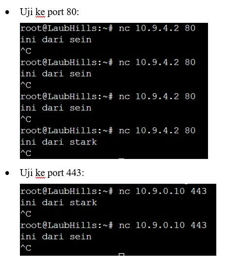

# Jarkom-Modul-5-B01-2023

| Name           | NRP        | Kelas     |
| ---            | ---        | ----------|
| Rr. Diajeng Alfisyahrinnisa Anandha | 5025211147 | Jaringan Komputer (B) |

# Gambar Topologi

<br></br>

# Soal 0
Setup

## Jawaban Soal 0

### Pembagian ip berdasarkan VLSM

<br></br>

<br></br>

### Setup network configuration di masing-masing node

```
prak 5

1. Aura:

auto eth0
iface eth0 inet dhcp

auto eth1
iface eth1 inet static
	address 10.9.0.5
	netmask 255.255.255.252

auto eth2
iface eth2 inet static
	address 10.9.0.1
	netmask 255.255.255.252


2. Heiter:

auto eth0
iface eth0 inet static
	address 10.9.0.2
	netmask 255.255.255.252
	gateway 10.9.0.1
	up echo nameserver 192.168.122.1 > /etc/resolv.conf

auto eth1
iface eth1 inet static
	address 10.9.4.1
	netmask 255.255.252.0

auto eth2
iface eth2 inet static
	address 10.9.8.1
	netmask 255.255.248.0

3. Turk Region:

auto eth0
iface eth0 inet dhcp

4. Sein:

auto eth0
iface eth0 inet static
	address 10.9.4.2
	netmask 255.255.252.0
	gateway 10.9.4.1
	up echo nameserver 192.168.122.1 > /etc/resolv.conf

5. GrobeForest:

auto eth0
iface eth0 inet dhcp

6. Frieren:

auto eth0
iface eth0 inet static
	address 10.9.0.6
	netmask 255.255.255.252
	gateway 10.9.0.5
	up echo nameserver 192.168.122.1 > /etc/resolv.conf

auto eth1
iface eth1 inet static
	address 10.9.0.13
	netmask 255.255.255.252

auto eth2
iface eth2 inet static
	address 10.9.0.9
	netmask 255.255.255.252

7. Himmel:

auto eth0
iface eth0 inet static
	address 10.9.0.14
	netmask 255.255.255.252
	gateway 10.9.0.13
	up echo nameserver 192.168.122.1 > /etc/resolv.conf

auto eth1
iface eth1 inet static
	address 10.9.0.129
	netmask 255.255.255.128

auto eth2
iface eth2 inet static
	address 10.9.2.1
	netmask 255.255.254.0

8. Laubhills:

auto eth0
iface eth0 inet dhcp

9. Scwhermountains

auto eth0
iface eth0 inet dhcp

10. Fern:

auto eth0
iface eth0 inet static
	address 10.9.0.131
	netmask 255.255.255.128
	gateway 10.9.0.129
	up echo nameserver 192.168.122.1 > /etc/resolv.conf

auto eth1
iface eth1 inet static
	address 10.9.0.21
	netmask 255.255.255.252

auto eth2
iface eth2 inet static
	address 10.9.0.17
	netmask 255.255.255.252

11. Richter:

auto eth0
iface eth0 inet static
	address 10.9.0.18
	netmask 255.255.255.252
	gateway 10.9.0.17
	up echo nameserver 192.168.122.1 > /etc/resolv.conf

12. Revolte (dhcp):

auto eth0
iface eth0 inet static
	address 10.9.0.22
	netmask 255.255.255.252
	gateway 10.9.0.21
	up echo nameserver 192.168.122.1 > /etc/resolv.conf


13. Stark:

auto eth0
iface eth0 inet static
	address 10.9.0.10
	netmask 255.255.255.252
	gateway 10.9.0.9
	up echo nameserver 192.168.122.1 > /etc/resolv.conf
```

### Setup routing di router

```
Routing:

1. Aura

//kanan

gw = 10.9.0.2

//heiter-turkregion
route add -net 10.9.8.0 netmask 255.255.248.0 gw 10.9.0.2

//heiter-sein-grobeforest

route add -net 10.9.4.0 netmask 255.255.252.0 gw 10.9.0.2

//bawah

gw = 10.9.0.6

//frieren-stark

route add -net 10.9.0.8 netmask 255.255.255.252 gw 10.9.0.6

//frieren-himmel

route add -net 10.9.0.12 netmask 255.255.255.252 gw 10.9.0.6

//himmel-laubhills

route add -net 10.9.2.0 netmask 255.255.254.0 gw 10.9.0.6

//himmel-fern-schwermountains

route add -net 10.9.0.128 netmask 255.255.255.128 gw 10.9.0.6

//fern-richter

route add -net 10.9.0.16 netmask 255.255.255.252 gw 10.9.0.6

//fern-revolte

route add -net 10.9.0.20 netmask 255.255.255.252 gw 10.9.0.6

2. Frieren

//kiri

gw = 10.9.0.14

//himmel-laubhills

route add -net 10.9.2.0 netmask 255.255.254.0 gw 10.9.0.14

//himmel-fern-schwermountains

route add -net 10.9.0.128 netmask 255.255.255.128 gw 10.9.0.14

//fern-richter

route add -net 10.9.0.16 netmask 255.255.255.252 gw 10.9.0.14

//fern-revolte

route add -net 10.9.0.20 netmask 255.255.255.252 gw 10.9.0.14


3. Himmel

//kiri
gw = 10.9.0.131

//fern-richter

route add -net 10.9.0.16 netmask 255.255.255.252 gw 10.9.0.131

//fern-revolte

route add -net 10.9.0.20 netmask 255.255.255.252 gw 10.9.0.131

4. Heiter

route add -net 0.0.0.0 netmask 0.0.0.0 gw 10.9.0.1

```

# Soal 1

Melakukan konfigurasi di node Aura menggunakan iptables tanpa menggunakan MASQUERADE

## Jawaban Soal 1

### Syntax iptables ditaruh di bashrc milik Aura
```
IPETH0="$(ip -br a | grep eth0 | awk '{print $NF}' | cut -d'/' -f1)"

iptables -t nat -A POSTROUTING -o eth0 -j SNAT --to-source "$IPETH0" -s 10.9.0.0/20
```

### Lalu, kita setup juga dhcp relay pada node heiter, aura, frieren, himmel, dan fern

```
apt-get update 
apt-get install isc-dhcp-relay -y

echo 'SERVERS="10.9.0.22"
INTERFACES="eth0 eth1 eth2"
OPTIONS=""' > /etc/default/isc-dhcp-relay

echo 'net.ipv4.ip_forward=1' > /etc/sysctl.conf

service isc-dhcp-relay restart
```

### Lalu, kita setup dhcp server di revolte

```
//dhcp server

#!/bin/bash

apt-get update 
apt-get install isc-dhcp-server -y

echo 'subnet 10.9.0.0 netmask 255.255.255.252 {
}

subnet 10.9.0.4 netmask 255.255.255.252 {
}

subnet 10.9.0.8 netmask 255.255.255.252 {
}

subnet 10.9.0.12 netmask 255.255.255.252 {
}

subnet 10.9.0.16 netmask 255.255.255.252 {
}

subnet 10.9.0.20 netmask 255.255.255.252 {
}

subnet 10.9.0.128 netmask 255.255.255.128 {
  range 10.9.0.132 10.9.0.254;
  option routers 10.9.0.129;
  option broadcast-address 10.9.0.255;
  option domain-name-servers 10.9.0.18;
  default-lease-time 180;
  max-lease-time 5760;
}

subnet 10.9.2.0 netmask 255.255.254.0 {
  range 10.9.2.3 10.9.3.254;
  option routers 10.9.2.1;
  option broadcast-address 10.9.3.255;
  option domain-name-servers 10.9.0.18;
  default-lease-time 180;
  max-lease-time 5760;
}

subnet 10.9.4.0 netmask 255.255.252.0 {
  range 10.9.4.3 10.9.7.254;
  option routers 10.9.4.1;
  option broadcast-address 10.9.7.255;
  option domain-name-servers 10.9.0.18;
  default-lease-time 180;
  max-lease-time 5760;
}

subnet 10.9.8.0 netmask 255.255.248.0 {
  range 10.9.8.3 10.9.15.254;
  option routers 10.9.8.1;
  option broadcast-address 10.9.15.255;
  option domain-name-servers 10.9.0.18;
  default-lease-time 180;
  max-lease-time 5760;
}' > /etc/dhcp/dhcpd.conf

echo 'INTERFACESv4="eth0"' > /etc/default/isc-dhcp-server

service isc-dhcp-server restart

service isc-dhcp-server status
```

### Kita setup juga di dns pada node richter

```
#!/bin/bash

apt-get update 
apt-get install bind9 -y

service bind9 restart
```

### Lalu, kita restart node worker dan kita coba untuk `ping google.com`

<br></br>

# Soal 2

Drop semua TCP dan UDP kecuali port 8080 pada TCP

## Jawab Soal 2

### Kita setup batasan TCP pada Turk Region

```
apt-get update
apt-get install netcat -y

iptables -A INPUT -p tcp --dport 8080 -j ACCEPT
iptables -A INPUT -p tcp ! --dport 8080 -j DROP
```

### Pengujian di turk region dapat dilakukan dengan:

```
#pengujian tcp 

nc -l -p 8080

# pengujian udp 

nc -u -l -p 8080
```

### Kita lakukan uji coba pada grobeforest

```
nc <ip turkregion> 8080
```

### Hasil uji coba

<br></br>
<br></br>

# Soal 3
Membatasi DHCP dan DNS Server hanya dapat dilakukan ping oleh maksimal 3 device secara bersamaan, selebihnya akan di drop

## Jawaban Soal 3

### Setup di Revolte

```
iptables -I INPUT -p icmp -m connlimit --connlimit-above 3 --connlimit-mask 0 -j DROP
iptables -I INPUT -m state --state ESTABLISHED,RELATED -j ACCEPT
```

> Hasil

<br></br>

### Setup di Richter

```
iptables -I INPUT -p icmp -m connlimit --connlimit-above 3 --connlimit-mask 0 -j DROP
iptables -I INPUT -m state --state ESTABLISHED,RELATED -j ACCEPT
```

> Hasil

<br></br>


# Soal 4

Lakukan pembatasan sehingga koneksi SSH pada webserver hanya dapat dilakukan pada GrobeForest

## Jawaban Soal 4

### Setup di sein dan stark

```
iptables -A INPUT -p tcp --dport 22 -m iprange --src-range 10.9.4.3-10.9.7.254 -j ACCEPT
iptables -A INPUT -p tcp --dport 22 -j DROP
```

### Uji coba di grobeforest

<br></br>

### Uji coba di turk region

<br></br>

# Soal 5
Pembatasan akses menuju webserver hanya diperbolehkan saat jam kerja yaitu senin-jumat pukul 08.00-16.00

## Jawaban Soal 5

### Taruh kode di sein dan stark
```
#!/bin/bash

# Dapatkan hari dalam seminggu (1=Senin, 7=Minggu)
DAY=$(date +%u)

# Dapatkan jam saat ini
HOUR=$(date +%H)

# Aturan iptables untuk memperbolehkan koneksi
RULE="iptables -I INPUT 1 -p tcp --dport 22 -m iprange --src-range 10.9.4.3-10.9.7.254 -j ACCEPT"

# Hapus aturan jika ada
iptables -D INPUT -p tcp --dport 22 -m iprange --src-range 10.9.4.3-10.9.7.254 -j ACCEPT 2> /dev/null

# Cek hari dan jam, tambahkan aturan jika sesuai
if [ "$DAY" -ge 1 ] && [ "$DAY" -le 5 ] && [ "$HOUR" -ge 8 ] && [ "$HOUR" -lt 16 ]; then
    eval $RULE
fi
```

### Hasil

<br></br>

# Soal 6

Akses webserver pada senin-kamis jam 12.00-13.00 serta hari jumat jam 11.00-13.00 dilarang

## Jawaban Soal 6

### Setup di sein dan stark

```
#!/bin/bash

# Dapatkan hari dalam seminggu (1=Senin, 7=Minggu)
DAY=$(date +%u)

# Dapatkan jam saat ini
HOUR=$(date +%H)

# Aturan iptables untuk memperbolehkan koneksi
ALLOW_RULE="iptables -I INPUT 1 -p tcp --dport 22 -m iprange --src-range 10.9.4.3-10.9.7.254 -j ACCEPT"

# Hapus aturan jika ada
iptables -D INPUT -p tcp --dport 22 -m iprange --src-range 10.9.4.3-10.9.7.254 -j ACCEPT 2> /dev/null

# Cek hari dan jam
if [ "$DAY" -ge 1 ] && [ "$DAY" -le 5 ]; then
    if [ "$DAY" -le 4 ] && ([ "$HOUR" -lt 12 ] || [ "$HOUR" -ge 13 ]); then
        # Senin hingga Kamis di luar jam 12.00-13.00
        eval $ALLOW_RULE
    elif [ "$DAY" -eq 5 ] && ([ "$HOUR" -lt 11 ] || [ "$HOUR" -ge 13 ]); then
        # Jumat di luar jam 11.00-13.00
        eval $ALLOW_RULE
    fi
fi
```

### Hasil

<br></br>

# Soal 7
Melakukan pemindahan ke sein dan stark di Himmel lalu uji di laubhills

## Jawaban Soal 7

### Setup kode pembatasan di router Himmel

```
#pemindahan routing ke sein dan stark

iptables -t nat -A PREROUTING -p tcp -d 10.9.4.2 --dport 80 -m statistic --mode nth --every 2 --packet 0 -j DNAT --to-destination 10.9.4.2
iptables -t nat -A PREROUTING -p tcp -d 10.9.4.2 --dport 80 -m statistic --mode nth --every 2 --packet 1 -j DNAT --to-destination 10.9.0.10

iptables -t nat -A PREROUTING -p tcp -d 10.9.0.10 --dport 443 -m statistic --mode nth --every 2 --packet 0 -j DNAT --to-destination 10.9.0.10
iptables -t nat -A PREROUTING -p tcp -d 10.9.0.10 --dport 443 -m statistic --mode nth --every 2 --packet 1 -j DNAT --to-destination 10.9.4.2
```

### Hasil uji

<br></br>

# Soal 8
Subnet dengan masyarakat yang berada pada Revolte dilarang keras megnakses webserver hingga masa pencoblosan pemilu selesai. 

## Jawaban Soal 8

Tidak boleh akses port 80 dari network id 10.9.0.16/30 mulai tanggal 16 Desember 2023 hingga 26 Juni 2024

### Setup kode taruh di sein dan stark

```
iptables -A INPUT -p tcp --dport 80 --source 10.9.0.21 -m time --datestart 2023-12-16 --datestop 2024-02-15 -j DROP
iptables -A INPUT -p tcp --dport 80 --source 10.9.0.22 -m time --datestart 2023-12-16 --datestop 2024-02-15 -j DROP
```

### Hasil

<br></br>

# Soal 9

WebServer harus dapat secara otomatis memblokir alamat IP yang melakukan scanning port dalam jumlah banyak (maksimal 20 scan port) dalam selang waktu 10 menit

## Jawaban Soal 9

### Setup kode di sein dan stark

```
# Membuat aturan untuk mendeteksi ping
iptables -A INPUT -p icmp --icmp-type echo-request -m recent --set

# Memblokir IP yang melakukan ping lebih dari 20 kali dalam 600 detik (10 menit)
iptables -A INPUT -p icmp --icmp-type echo-request -m recent --update --seconds 600 --hitcount 21 -j DROP
```

### Hasil

<br></br>

# Soal 10

Setiap node server dan router ditambahkan logging paket yang di drop dengan standard syslog level

## Jawaban Soal 10

### Taruh kode di semua node server dan router

```
touch /var/log/iptables.log

iptables -N LOGGING
iptables -A INPUT -j LOGGING
iptables -A OUTPUT -j LOGGING
iptables -A LOGGING -m limit --limit 2/min -j LOG --log-prefix "IPTables-Dropped: " --log-level 4
iptables -A INPUT -j LOG --log-prefix "Dropped packet: " --log-level 4

echo 'kern.warning	/var/log/iptables.log ' >> /etc/rsyslog.conf
/etc/init.d/rsyslog restart
```

## Kendala pengerjaan no 10
Belum bisa memunculkan log packet yang di drop 